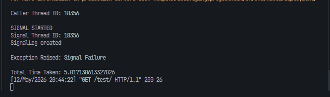
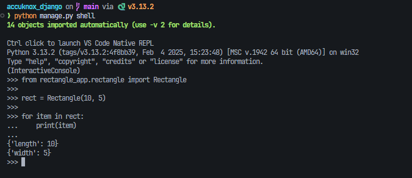

# Accuknox Django Trainee Assignment

This repository contains solutions for the Django trainee assignment.

The assignment includes:

1. Django Signals behavior analysis
2. Custom iterable Rectangle class in Python

---

# Project Structure

```text
accuknox_django/
│
├── core/
├── signals_demo/
├── rectangle_app/
├── screenshots/
├── manage.py
├── requirements.txt
└── README.md
```

---

# Setup Instructions

## Clone Repository

```bash
git clone <repository_url>
cd accuknox_django
```

## Create Virtual Environment

```bash
python -m venv venv
```

## Activate Virtual Environment (Windows)

```bash
.\venv\Scripts\activate
```

## Install Dependencies

```bash
pip install -r requirements.txt
```

## Run Migrations

```bash
python manage.py makemigrations
python manage.py migrate
```

## Start Server

```bash
python manage.py runserver
```

---

# Django Signals

## Question 1

### By default, are Django signals executed synchronously or asynchronously?

Django signals execute synchronously by default.

To verify this, a `time.sleep(5)` delay was added inside the signal handler.

The request took around 5 seconds to complete, which shows that the caller waits for the signal execution to finish.

### Observed Output

```text
Total Time Taken: ~5.01 seconds
```

---

## Question 2

### Do Django signals run in the same thread as the caller?

Yes. Django signals run in the same thread as the caller by default.

Thread IDs were printed from:
- the caller
- the signal handler

Both thread IDs were identical.

### Observed Output

```text
Caller Thread ID: 18356
Signal Thread ID: 18356
```

### Screenshot



---

## Question 3

### Do Django signals run in the same database transaction as the caller?

Yes.

The database operation was wrapped inside `transaction.atomic()`.

Inside the signal handler:
- a new database record was created
- an exception was raised intentionally

After the exception, both database operations were rolled back successfully.

### Final Database State

```text
<QuerySet []>
<QuerySet []>
```

### Screenshot


This confirms that both operations were part of the same database transaction.

---

# Rectangle Iterator Problem

The `Rectangle` class:
- accepts `length` and `width`
- supports iteration using `__iter__()`
- returns length first and width second

## Example

```python
rect = Rectangle(10, 5)

for item in rect:
    print(item)
```

### Output

```text
{'length': 10}
{'width': 5}
```

### Screenshot



---

# Running Tests

```bash
python manage.py test
```

---

# Tech Stack

- Python 3.13
- Django 5.x
- SQLite
